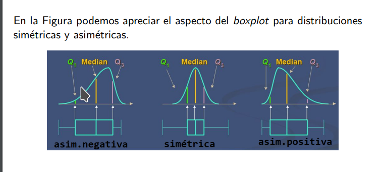

```{r setup, include=FALSE}
knitr::opts_chunk$set(echo = T, warning = F, message = F)
source("Unidad0_repos_and_tools.R")

df <- list()
df$IMCinfantil <- readxl::read_excel("~/research_tools/utn_analisis_inteligente_datos/IMCinfantil.xlsx")
df$gorriones <- readxl::read_excel("~/research_tools/utn_analisis_inteligente_datos/gorriones.xlsx")
df$Internet2013 <- readxl::read_excel("~/research_tools/utn_analisis_inteligente_datos/Internet2013.xlsx")
df$recepcionistas <- readxl::read_excel("~/research_tools/utn_analisis_inteligente_datos/recepcionistas.xlsx")
# falta razaperros

```


```{r}
multieda <- function(list, df = 1){
  
  lista_resultados <- list()
  
  # CV = proporcion que representa el desvıo estandar de la media aritmetica
  lista_resultados$coeficiente_variacion <- list[[df]] %>% 
    dplyr::select_if(is.numeric) %>% 
    summarise_all(raster::cv, na.rm =T) 
  
  lista_resultados$sesgo <- list[[df]] %>% 
    dplyr::select_if(is.numeric) %>% 
    summarise_all(moments::skewness) 
  
  # Las distribuciones leptocurticas tienen coeficientes superiores a 3 y las
  # platicurticas coeficientes menores a 3
  
  lista_resultados$curtosis <- list[[df]] %>% 
    dplyr::select_if(is.numeric) %>% 
    summarise_all(moments::kurtosis)
  
  # Estadística Robusta
  
  # Median Absolute Deviation= mediana de los desvıos absolutos respecto de la mediana
  lista_resultados$mad <- list[[df]] %>% 
    dplyr::select_if(is.numeric) %>% 
    summarise_all(mad)
  
  # grafico de correlacion
  lista_resultados$m_correlacion <- list[[df]] %>%
    select_if(is.numeric) %>% 
    cor(., use="complete.obs") %>% 
    round(., 2)   
  
  lista_resultados
}

```

# Trabajo práctico 1

```{r}
dataset = 4
results = multieda(df, dataset)
```

## Análisis data set: `r names(df[dataset])`

### Resumen

```{r, skimr_digits = 1, R.options = list(width = 20)}
knit_print(skim(df[[dataset]]))
```

### Distribución de datos

```{r}
knit_print(results)
```

<!-- ### Gràfico de correlacion  -->

<!-- ```{r} -->
<!-- corrplot::corrplot.mixed(results$m_correlacion ,order = 'AOE')  -->
<!-- ``` -->

### Explorarcion de interrogantes

```{r}
datos = df[[dataset]]
columnas = names(datos)[-1]

datos <- datos %>% 
  pivot_longer(cols = columnas, names_to = 'variables', values_to = 'valores') %>% 
  mutate(variables = str_remove_all(variables, ' ')) %>% 
  separate(col = variables, into = c('variables', 'juez'), sep = '\\.') 
  
```

#### Ranking por candidatos por juez: no existe coincidencia en el primer puesto.

```{r}
datos %>% 
  group_by(juez, candidatos) %>% 
  summarise(promedio = round(mean(valores), digits = 2)) %>% 
  arrange(juez, desc(promedio)) %>% 
  kable()
```

#### Promedio de cada una de las aspirantes tomando en cuenta todos los rubros y ambos jueces

```{r}
datos %>% group_by(candidatos) %>% summarise(promedio = round(mean(valores), digits = 2)) %>% 
  arrange(desc(promedio)) %>% 
  kable()
```

#### Transformar las puntuaciones 

Vamos a centrar los valores para evitar el sesgo de los jueces al momento de la asignación de puntajes. Esto permitirá centrar los valores (promedio en 0 y sd en 1) con el fin de permitir su comparación. Luego vamos a sumar los valores obtenidos por cada candidata.

```{r}
datos %>% 
  mutate(valores_tr = scale(valores)) %>% 
  group_by(candidatos) %>% 
  summarise(suma_valores_tr = sum(valores_tr, na.rm = T)) %>% 
  arrange(desc(suma_valores_tr)) %>% 
  ggplot(aes(x= reorder(candidatos, -suma_valores_tr), y = suma_valores_tr)) +
  geom_bar(stat = 'identity')
```

# Exploración para profundizar aprendizaje

```{r}
# otros estadìsticos
datos_matriz <- datos %>% 
  pivot_wider(names_from = variables, values_from = valores) #%>% 
  #mutate(juez = as.integer(str_remove_all(juez, '[a-z]')))

# Depende de las unidades en que se miden las variables
matriz_varianza <- datos_matriz %>% 
  select_if(is.numeric) %>% 
  var(., use="complete.obs") %>% 
  round(., 2)   

matriz_covarianza <- datos_matriz %>% 
  select_if(is.numeric) %>% 
  cov(., use="complete.obs") %>% 
  round(., 2)   

# correlacion: covarianza de los datos estandarizados
matriz_correlacion <- datos_matriz %>% 
  select_if(is.numeric) %>% 
  cor(., use="complete.obs") %>% 
  round(., 2)   


determinante <- det(matriz_covarianza)
```

```{r}
datos_matriz
```

```{r}
matriz_varianza
```

```{r}
matriz_covarianza
```

```{r}
matriz_correlacion
```

```{r}
corrplot::corrplot.mixed(matriz_correlacion ,order = 'AOE')
```

# Determinante distinto de 0 => independencia lineal

```{r}
determinante
```

# Ortogonal

Dos vectores son ortogonales, o perpendiculares, si y sólo si su producto escalar ('dot product' = suma de los productos de sus componentes) es cero.

# Revisión de los analíticos estudiados

Atención que la función 'var' en R calcula la varianza teniendo como divisor 'n-1', que no coincide con las formulas de Peña.

```{r}
round(var(datos_matriz$cord), digits = 2) == 
  round(sum((datos_matriz$cord - mean(datos_matriz$cord))^2) / 
          (length(datos_matriz$cord)-1), digits = 2) # este -1 es muy importante

```
# desviación estandar 

sd() = raíz cuadrada de la suma de las desviaciones al cuadrado dividio n

```{r}
round(sd(datos_matriz$cord), digits = 2)
sqrt(round(sum((datos_matriz$cord - mean(datos_matriz$cord))^2) / 
          (length(datos_matriz$cord)-1), digits = 2)) 
```
# varianza 

var() = el cuadrado de la sd()

```{r}
sqrt(round(sum((datos_matriz$cord - mean(datos_matriz$cord))^2) / 
          (length(datos_matriz$cord)-1), digits = 2))^2 # el cuadrado de la desviación típica
```

# Covarianza 

cov() = suma( var(x) * var (y)) / n-1 . Su producto expresa la dependencia lineal

La matriz de covarianza es real, simétrica y de orden **p** por lo cual tiene **p** autovalores reales, con sus correspondientes autovectores. Además es semidefinida positiva lo que dice que sus autovalores son no negativos. 

```{r}

sum((datos_matriz$cord - mean(datos_matriz$cord)) * (datos_matriz$pres - mean(datos_matriz$pres))) / (length(datos_matriz$cord)-1)
  

```
# Distribuciones

```{r}

```

\pagebreak

```{r}
dataset = 1
results = multieda(df, dataset)
```

## Análisis data set: `r names(df[dataset])`

### Resumen

```{r, skimr_digits = 1, R.options = list(width = 20)}
knit_print(skim(df[[dataset]]))
```

### Distribución de datos

```{r, }
knit_print(results)
```

### Gràfico de correlacion 

```{r}
corrplot::corrplot.mixed(results$m_correlacion ,order = 'AOE') 
```


# Distancia de Mahalanobis

Es efectiva en datos multivariados pues utiliza la covarianza entre variables para medir la distancia entre dos observaciones. 

Aquí hemos agregado la distancia de mahalanobis y hemos detectado outliers por su valor p. Fltramos el dataframe por la filas cuya probabilidad sean menores a 0.001.

```{r}
# Distancia de Mahalanobis
  temp <- df[[dataset]] %>% 
    dplyr::select_if(is.numeric) 
  
  temp$mahalanobis <- mahalanobis(temp, colMeans(temp), cov(temp))
  
  temp$pvalue <- pchisq(temp$mahalanobis, df =7, lower.tail=FALSE)
  
  temp$outlier <- temp$pvalue < 0.001
  
  kable(temp[temp$outlier, ])
```
Graficamos las distancias de Mahalanobis y vemos outliers. Se destacan más datos que por valor p.


```{r}
boxplot(temp$mahalanobis, ylab = "Distancias de Mahalanobis")
```

# Traza 

traza = sum(diagonal matriz cuadrada). 

En el caso de la matriz de var-covar la traza daría por resultado la **suma de las varianzas** y por lo tanto una idea de la magnitud del problema a explicar.  Por eso se asocia con el concepto de **variabilidad total**. 

\pagebreak

```{r}
dataset = 2
results = multieda(df, dataset)
```

## Análisis data set: `r names(df[dataset])`

### Resumen

```{r, skimr_digits = 1, R.options = list(width = 20)}
knit_print(skim(df[[dataset]]))
```

### Distribución de datos

```{r, }
knit_print(results)
```

### Gràfico de correlacion 

```{r}
corrplot::corrplot.mixed(results$m_correlacion ,order = 'AOE') 
```

\pagebreak

```{r}
dataset = 3
results = multieda(df, dataset)
```

## Análisis data set: `r names(df[dataset])`

### Resumen

```{r, skimr_digits = 1, R.options = list(width = 20)}
knit_print(skim(df[[dataset]]))
```

### Distribución de datos

```{r, }
knit_print(results)
```

### Gràfico de correlacion 

```{r}
corrplot::corrplot.mixed(results$m_correlacion ,order = 'AOE') 
```


\pagebreak

