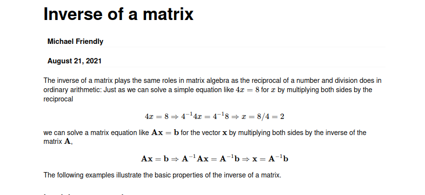

```{r setup, include=FALSE}
knitr::opts_chunk$set(echo = T, warning = F, message = F)
source("Unidad0_repos_and_tools.R")

df <- list()

# https://rpubs.com/ercalel/593452
# https://bookdown.org/jsalinas/tecnicas_multivariadas/acp.html


```

# Analisis componente principal

**Fundamentos teóricos**: Comprensión de Matrices Ejemplo libro AID, p.88

**Bibliografìa**: https://www.cienciadedatos.net/documentos/35_principal_component_analysis 

El análisis de CP tiene su fundamento en la necesidad de analizar las relaciones que se establecen entre  múltiples variables cuantitativas. Por ejemplo, la correlación establece una relación entre dos variables, pero no representa relaciones triádicas. 

En este contexto, para datos multivariados, se plantea el problema de la reducción de la dimensionalidad. 

El ACP es un procedimiento matemático por el cual se transforma un conjunto de variables correlacionadas en un conjunto de variables no-correlacionadas de menor dimensión. El procedimiento se basa en la *combinación lineal* de las variables originales sujeto a la restricción de que la combinación conseve la *mayor variabilidad* posible del conjunto original de observaciones. Objetivo de la combinación lineal: maximizar la varianza (o minimiza la pérdida de información de los datos), permitiendo reducir la dimensionalidad del problema con la menor pérdida de información.

En el contexto ACP tenemos que:   

- objetivo reducir dimensión, descartar información redundante,   
- solo válido cuando existe correlación entre variables,   
- se explora existencia de variables latentes,    

**Variablidad explicada**   
 
La variabilidad de la primer componente es máxima cuando el vector de cargas es el autovector asociado al mayor autovalor de la matriz de covarianzas. Así, para maximizar la varianza de la primera componente los coeficientes de la combinación lineal deben ser los elementos del autovector de norma 1 asociado al mayor autovalor de la matriz. 

Para buscar la segunda y sucesivas componentes se busca una nueva combinación lineal de las variables originales, que maximice la variabilidad (comprobamos que eso se logra cuando los coeficientes corresponden al autovector asociado al segundo autovalor) y sea ortogonal a la primera componente. 

Dada la formula para deducir las componentes se advierte que las mismas no pueden tener correlación.    


# Cantidad de componentes a utilizar en un análisis CP

1. Porcentaje de variabilidad explicada: se define un % mínimo que se desea explicar y se eligen n variables hasta alcanzar ese valor.    
2. Criterio de Laiser: consiste en retener las primeras m componentes cuyos autovalores resulten => 1, aunque algunos autores recomiendas 0.7
3. Criterio del bastón roto: a partir de un gráfico de sedimentación elegir m componentes hasta observar que la variabilidad explicada se estabiliza. Donde la pendiente se suaviza, el gradiente es menor que el segmento anterior.
4. Prueba de Esfericidad: 


# Estimación de CP a partir de datos poblacionales

Hemos desarrollado la idea de CP sobre la base de la matriz de covarianza poblaciónal. Sin embargo, es matriz difícilmente se conozca, por eso trabajamos con la matriz muestral.


```{r, fig.width=20, fig.height=18}

```

```{r}
A= matrix(c(1,2,-1,1,0,1,3,1,0,0,2,0,0,0,1,-1), nrow=4,ncol=4,byrow=T)#Ingresaunamatrizde4x4
A#Muestralamatriz
```

```{r}
eigen(A)
```

```{r}
##Compararlossiguientescálculos:
sum(diag(A)) #CalculalatrazadeA
sum(eigen(A)$values) #CalculalasumadelosautovaloresdeA
# La suma de los valores propios es igual a la traza

```

```{r}
##Compararlossiguientescálculos:
det(A)#CalculaeldeterminantedeA
prod(eigen(A)$values)#CalculaelproductodelosautovaloresdeA
t(A)#CalculalatraspuestadeA
```

```{r}
#Observar que lastrazas de una matriz y sutraspuesta son iguales
sum(diag(t(A))) #Calculala traza de la traspuesta de A

```

```{r}
# los determinantes de la traspuesta de A son iguales a los det de A
det(t(A))

```

```{r}
#Observarquelosautovaloresdeunamatrizysutraspuestasonlosmismos
eigen(t(A))$values
```

```{r}
#CalculalainversadeA
solve(A)
```

```{r}
solve(A)
```

```{r}
zapsmall(ginv(A))
```

```{r}
# # Verifica que A y solve(A) son matrices inversas
# A%∗%solve(A) no pude correr por falta libreria 
zapsmall(ginv(A)) == solve(A)
```

```{r}
all.equal(zapsmall(ginv(A)),solve(A))
```
Verifico con funcion de Debora

```{r}
A%*%solve(A) 
```


```{r}
#Observarquelosdeterminantesdeunamatriz y su inversa son inversos
det(A)
det(solve(A))

```


```{r}
#Observarquelosautovaloresdeunamatrizyysuinversasoninversos
eigen(A)$values
eigen(solve(A))$values

```
# Trabajo practico 2

```{r}
# Import matrix
m = as.integer(strsplit(as.character(c("3 1 1 1 3 1 1 1 5")), " ")[[1]])
m =  matrix(m, nrow = 3, byrow = T)
m

```

Valores propios

```{r}
lambda <- eigen(m)
lambda
```
Primer valor propio
```{r}
lambda$values[1]

```

# PCA

```{r}
df_raw <- readxl::read_excel("~/research_tools/utn_analisis_inteligente_datos/nadadores.xlsx")
#df <- df 
df = df_raw %>% dplyr::select(-Nadador)
df
```

```{r}
kable(df_raw)
```

```{r}
skim(df_raw)
```

La varianza de los datos es muy parecida (sd) por lo que las variables tienen distribuciones similares.

# Analisis PCA

Aplicamos funciòn a nuestro df, sin nadadores

```{r}
df_pca_corr =  prcomp(df, center = TRUE, scale. = T)
```

La salida tiene los siguientes elementos

```{r}
names(df_pca_corr)
```
Los elementos center y scale almacenados en el objeto pca contienen la media y desviación típica de las variables previa estandarización (en la escala original).

```{r}
df_pca_corr$center
```
```{r}
df_pca_corr$scale
```
rotation contiene el valor de los loadings ϕ para cada componente (vector propio, autovector o eigenvector). El número máximo de componentes principales se corresponde con el mínimo(n-1,p),

```{r}
df_pca_corr$rotation
```
Analizar en detalle el vector de *loadings* que forma cada componente ayuda a determinar què informaciòn aporta cada una. Por ejemplo la primera componente es el resultado de la siguiente combinación lineal de las variables, en este caso los tramos de la carrera.

```{r}
df_pca_corr$rotation[,1]
```
Todos los valores son muy parecidos, esto quiere decir que la primera componente es de Tamaño y recoge informaciòn que está expresada en el data set, es de tamaño y referiría a la velocidad o desempeño de los nadadores. A diferencia de la segunda componente que es de forma, donde hay dos loading que son positivos y dos negativos que estarían vinculados a los tramos.


La funciòn tambièn calcula automáticamente el valor de las componentes principales para cada observaciòn o individuo del data set (principal componente score) mediante la multiplicación de los datos con los loadings como sigue:  se tienen que multiplicar los eigenvectors transpuestos por los datos originales centrados y también transpuestos.

```{r}
df_pca_corr$x
```


```{r}
biplot(x = df_pca_corr, scale = 0, cex = 0.6, col = c("blue4", "brown3"))
```
# Varianza explicada por las CP

```{r}
summary(df_pca_corr)
```
Manualmente la varianza serìa

```{r}
df_pca_corr$sdev^2
```

```{r}
prop_varianza = df_pca_corr$sdev^2 / sum(df_pca_corr$sdev^2)

ggplot(data = data.frame(prop_varianza, pc = 1:length(prop_varianza)),
       aes(x = pc, y = prop_varianza)) +
  geom_col(width = 0.3) +
  geom_text(label = round(prop_varianza * 100, digits = 1)) +
  scale_y_continuous(limits = c(0,1)) +
  theme_bw() +
  labs(x = "Componente principal",
       y = "Prop. de varianza explicada")

```


```{r}
prop_varianza_acum <- cumsum(prop_varianza)

ggplot(data = data.frame(prop_varianza_acum, pc = 1:length(prop_varianza_acum)),
       aes(x = pc, y = prop_varianza_acum, group = 1)) +
  geom_point() +
  geom_line() +
  geom_text(label = round(prop_varianza_acum * 100, digits = 1), vjust =-.5) +
  labs(x = "Componente principal",
       y = "Prop. varianza explicada acumulada")

```


