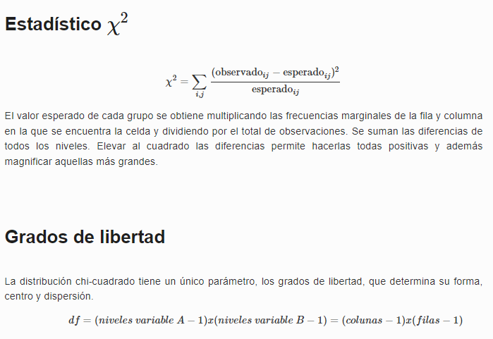
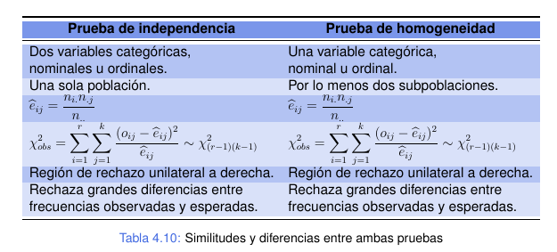
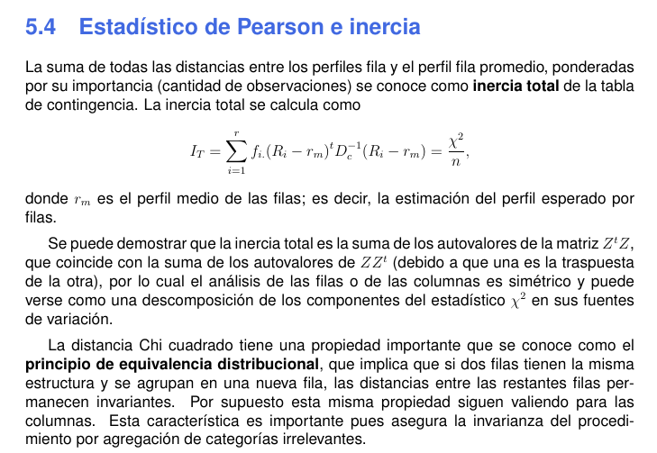

```{r setup, include=FALSE}
knitr::opts_chunk$set(echo = T, warning = F, message = F)
source("Unidad0_repos_and_tools.R")

```

# Analisis de Correspondencia

+ Simples (dos variables categóricas, independientemente sus niveles de medición): 
- Contraste de Independencia (test de Chi-Cuadrado) 
- Contraste de Homegenidad
+ Múltiples (más de dos variables)


El análisis de correspondencias es una técnica descriptiva para representar tablas de contingencia, es decir, tablas donde recogemos las frecuencias de aparición de dos o más variables cualitativas en un conjunto de elementos. Constituye el equivalente de componentes principales y coordenadas principales para variables cualitativas.     

El análisis de correspondencia es una forma de resumir la información de una tabla de contigencia. Puede ser vista como una manera de representar las variables en un espacio de dimensión menor, de forma análoga a componentes principales, pero definiendo la distancia entre los puntos de manera coherente con la interpretación de los datos. En lugar de utilizar la distancia euclídea utilizamos la distancia chi-cuadrado, para poder apreciar los patrones de asociación.

Se trabaja con las frecuencias relativas en una matriz F, que se obtiene dividiendo cada celda por n (total de observaciones).   

La particularidad de este análisis es que, por ejemplo, en un análisis por fila (que daría como resultado el mismo si se hiciera por columna, porque la forma en que se dispone las variables en F es arbitrario) cada fila puede presentar una frecuencia relativa distinta a la de las demás. Por eso:   

- las filas tienen distinto pesos segùn n,    
- la distancia euclidea no es una buena aproximación a la representaciòn de la proximidad entre los vectores fila porque no incorpora el elemento de peso relativo de cada perfil fila, trata igual a todos los vectores (y sus valores absolutos).   

En cambio, supongamos que trabajamos con una matriz R, con frecuencias relativas **condicionadas** al total de la fila, de tal manera que el total marginal fila suma 1, obtendremos la distribuciòn de la variable en columnas condicionadas a la fila para todos los perfiles. En este caso, hay que destacar que es muy importante para obtener comparaciones razonables que el cotejo de las distancias entre los atributos evaluados tome en consideración la frecuencia relativa de aparición del atributo. Es decir, en atributos raros pequeñas diferencias absolutas puede ser equivalente a grandes distancias relativas comparadas con atributos más frecuentes. 

## Perfil medio

El concepto de perfil dado por un conjunto de frecuencias relativas, es fundamental para el análisis de correspondencias. Estos conjuntos de frecuencias relativas, también llamados vectores, tienen características geométricas especiales debido a que la suma de sus elementos es igual a 1 (lo que representa el 100%).


## Test Chi-Cuadrado de Indenpendencia (Pearson)

Eventos Independientes: Diremos que dos eventos son independientes cuando la ocurrencia de uno de ellos no afecta la probabilidad de ocurrencia del otro. Formalmente: A y B son Independientes ⇔ P(A/B) = P(A).

Es decir, bajo el supuesto de indenpendencia se esperaría que la probabilidad conjunta en ij resulte del producto de sus respectivas probabilidades marginales.  

Cuantificando la diferencia entre las frecuencias esperadas y las observadas en tabla de frecuencia: estadístico Chi-cuadrado de Pearson. Mide la discrepancia entre las frecuencias observadas respecto de las esperadas, a fin de determinar si tales discrepancias son suficientes para contradecir la hipótesis de independencia o son producto (esperable) del azar.

```{r}

```

**Requisitos**

Por todo esto este test solo es valido si todas las frecuencias esperadas son superiores a 1 y a lo sumo el 20% de las mismas inferior a 5. 


## Test Chi-Cuadrado de homogeneidad

Nos interesa evaluar si una variable aleatoria sigue la misma distribución en distintos subgrupos de una población, estos subgrupos pueden verse como subpoblaciones. 


```{r}

```

**Perfil medio**    

El perfil columma medio se obtiene como el cociente entre el total de las filas y el total general. De esta manera se pueden comparar los perfiles columna con el perfil de columna medio

De igual forma el perfil fila medio se obtiene dividiendo los totales de las columnas por el total general.


**Inercia y Principio de equivalencia distribucional**

La inercia total de la tabla de contingencia es la suma de todas las distancias de los perfiles files al perfil fila medio, ponderadas por su importancia (cantidad de observaciones). Se calcula como el cociente entre el estadístico Chi-Cuadrado y el tamaño muestral. 

*X2 / n*

Respecto del ppio de ED esta propiedad es que si dos filas tienen la misma estructura relativa, fij /fi. y las unimos en una nueva fila única, las distancias entre las restantes filas permanecen invariables. 

```{r}

```

## Bibplot Simétrico

- los perfiles fila/columna cercanos al origen muestran categorías similares al perfil medio,    
- los ejes representan variables latentes,    
- cada eje se indica el % de inercia que logra representar de los datos,  

## Text exacto de Fisher

Permite analizar si dos variables dicotómicas están asociadas cuando la muestra es demasiado pequeña y no se cumples los supuestos para aplicar Chi-Cuadrado. Matriz 2 * 2. 

```{r}
datos <- data.frame( sujeto = c("No alérgico", "No alérgico", "No alérgico",
                                "No alérgico", "alérgico", "No alérgico",
                                "No alérgico", "alérgico", "alérgico",
                                "No alérgico", "alérgico", "alérgico",
                                "alérgico", "alérgico", "alérgico",
                                "No alérgico", "No alérgico", "No alérgico",
                                "No alérgico", "alérgico", "alérgico",
                                "alérgico", "alérgico", "No alérgico",
                                "alérgico", "No alérgico", "No alérgico",
                                "alérgico","alérgico", "alérgico"),
                     mutacion = c(FALSE, FALSE, FALSE, FALSE, TRUE, FALSE,
                                  FALSE, FALSE, TRUE, TRUE, TRUE, TRUE, TRUE,
                                  TRUE, FALSE,  FALSE, TRUE, FALSE, TRUE, FALSE,
                                  TRUE, FALSE,FALSE, FALSE, TRUE, FALSE, FALSE,
                                  TRUE, FALSE, TRUE))


tabla <- table(datos$sujeto, datos$mutacion, dnn = c("Sujeto", "Estado gen"))
fisher.test(x = tabla, alternative = "two.sided")
```
```{r}
library(vcd)
assocstats(x = tabla)
```

## Analisis de Correspondencia Múltiple

Similar al AC simple, pero empleando una matriz disyuntiva o matris de Burt. La matriz de Burt resulta del producto entre la matriz disyuntiva completa y su traspuesta. Implica que la MB es una matriz simétrica, definida positiva (como la de covarianza).